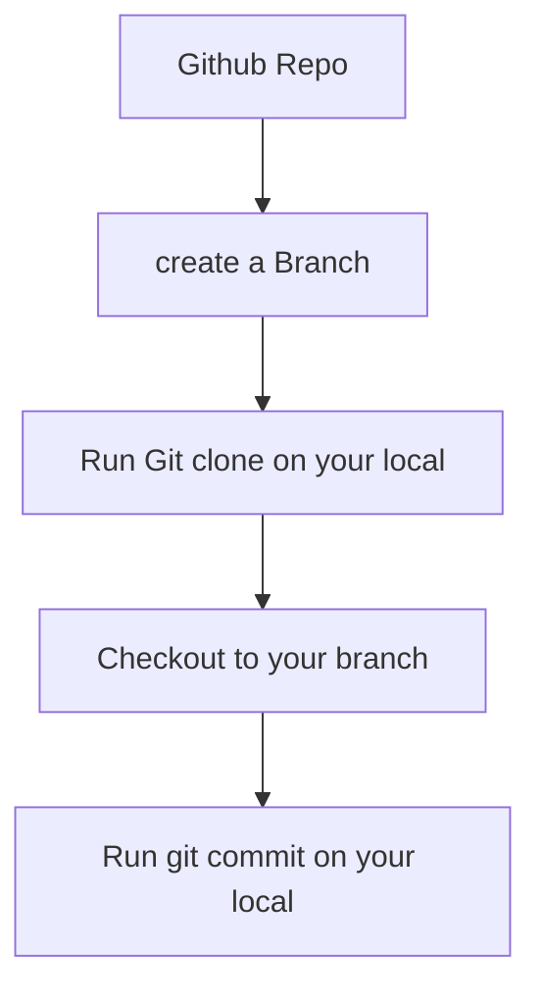

# github-learning

```mermaid
flowchart

A[Github Repo] --> B[create a Branch]
B --> C[Run Git clone on your local ]
C--> D[Checkout to your branch]
D--> E[Run git commit on your local]


```

## Generating ssh keygeneration

```mermaid
flowchart
A[Open a terminal in your windows DOS or git bash] --> B [Run 'ssh-keygen -t ed25519 -C "your_email@example.com"']

```
