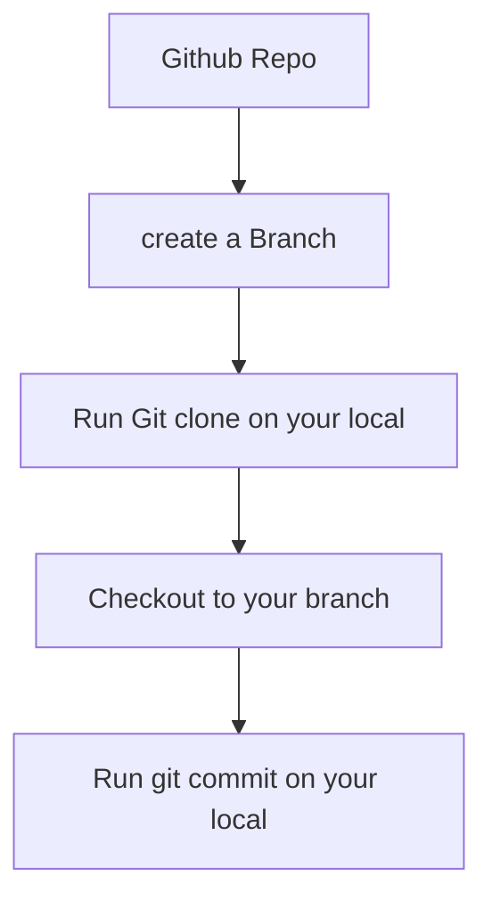

# github-learning


```mermaid
flowchart
A[Github commit] --> B[in the terminal get inside of your folder/file]
B --> C[write 'git add --all']
C--> D[write git commit -am 'my first commit']
D -->E[git push]
